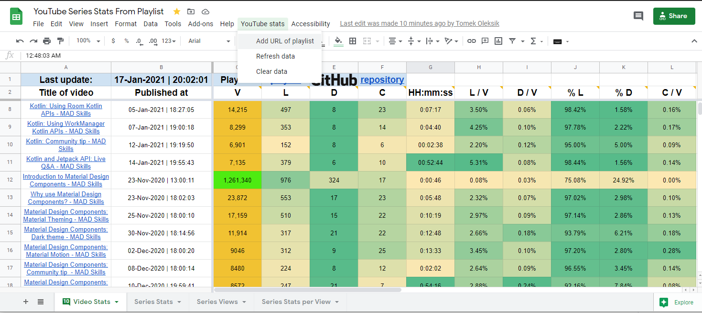
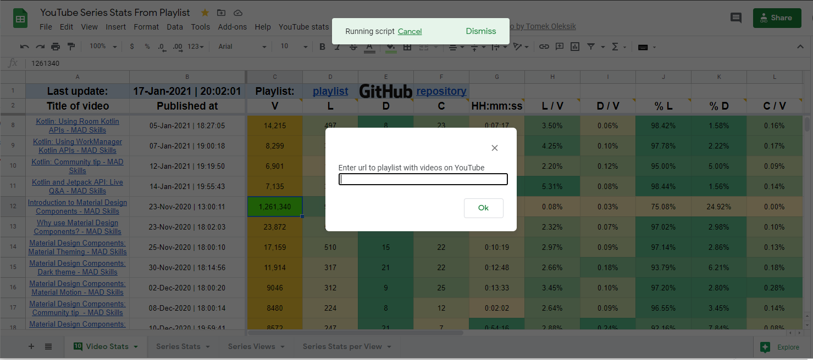
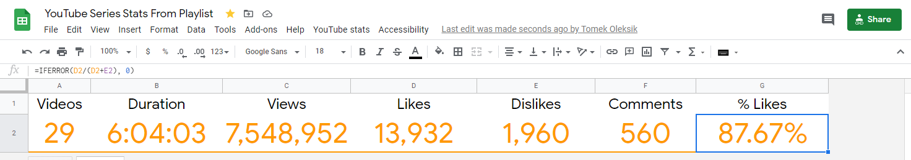
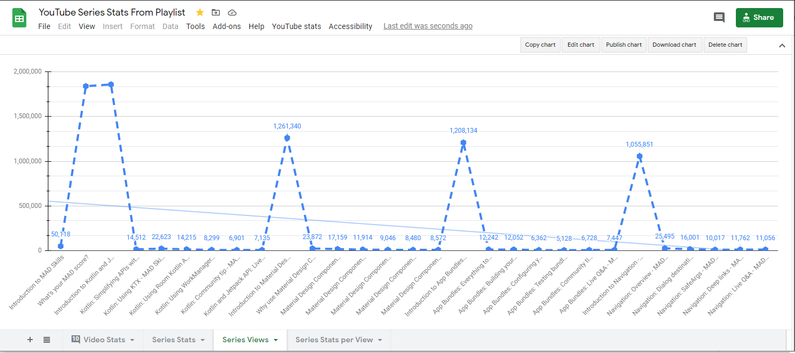
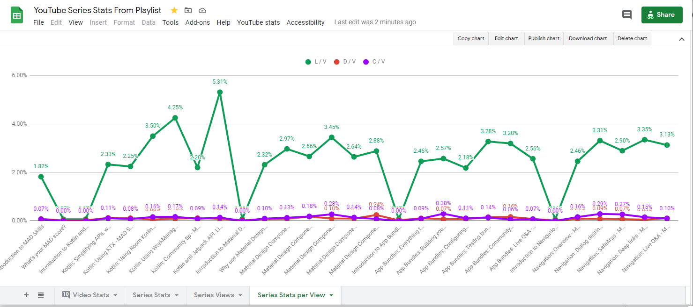

# gscript-video-statistics-from-the-given-playlist-on-YouTube
This script retrieves information about movies in the playlist you provided and shows the statistics of those movies with the use of Google Sheets. Thanks to this, you can compare all videos from a given playlist.

The project with the use of Google Sheet and Google Apps Script allows you to check information on various parameters of videos in a given playlist using [YouTube Api](https://developers.google.com/youtube/v3/docs) (of course, they can be playlists on a different account than yours).
This was inspired by [this article](https://dev.to/rick_viscomi/using-sheets-and-the-youtube-api-to-track-video-analytics-6el) and I use part of this code, which you can check in the commit history.
Thanks to this, we can observe the popularity and interest in subsequent films, and whether they like them. They are measured:
- number of views,
- like,
- dislike,
- comments,
- duration of the video,
- likes per view,
- dislikes per view,
- percent likes,
- percent dislikes,
- comments per view.
  
In addition, you can see in the lines which movie the statistics are related to, along with a link to that movie, and information when the movie was published.
An option from the `YouTube stats` menu is added to the Google Sheet. You will find options here:
- adding the URL of the playlist you want to research,
- manual refresh of the recently added playlist,
- clearing the data in the sheet.

The data is presented with summary data and easy-to-read charts and illustrate what the script provides. See the following tabs: `Series Stats`, `Series Views`, `Series Stats per View`.

The script is automatically called by the trigger every specified time, so the data of the last playlist is always up to date. Google Sheet saves the history of file changes and you can also view historical data to compare them with the current ones, for example.

To use this solution, copy my Google Sheet file to your Google Drive and use [Google Apps Script](https://www.google.com/script/start/).








Known bug:
```
GoogleJsonResponseException: API call to youtube.videos.list failed with error: The request specifies an invalid filter parameter.

```

over 50 videos in the playlist (max request in YouTube API is 50).

In columns `H`, `I`, `J`, `K`, `L` the results are calculated with Excel functions. If you want to practice, you can replace these functions with Google Apps Script functions. :)
